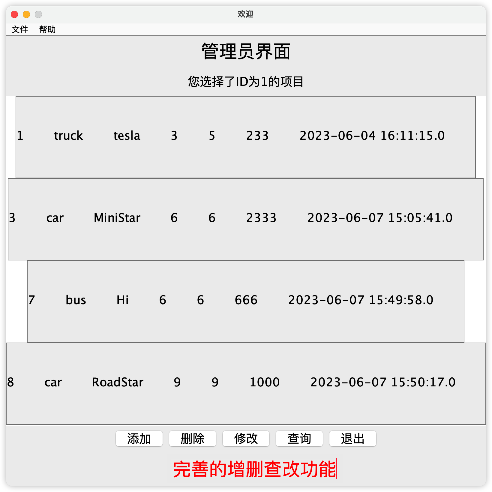

# iRentalSystem
吉林大学Java大作业

## 项目介绍
本项目是吉林大学2023年春季学期Java程序设计大作业，是一个基于Java Swing开发的租赁系统，主要功能有：

1. 完整的GUI界面
2. 租赁物品的增删改查
3. 用户注册、登录等功能
4. 完善的MySQL数据库支持

## 项目结构
```
iRentalSystem
├─ database (MySQL数据库存档)
│  └─ database.sql
├─ resource (图标等资源文件)
│  ├─ icon
│  └─ img
├─ src  (源代码)
│  ├─ gui   (GUI界面部分)
│  │  ├─ components
│  │  ├─ views
│  │  ├─ actions.java
│  │  └─ sys.java
│  ├─ lib   (第三方库，这里为MySQL驱动)
│  │  └─ mysql-connector-java-8.0.33.jar
│  ├─ sql   (对数据库的操作)
│  │  └─ ......
│  ├─ utils (工具类)
│  └─ Main.java (程序入口)
├─ .gitignore
├─ LICENSE
└─ README.md
```

## 项目截图




## 项目依赖
- Java 8
- MySQL 8 （驱动已包含在项目中）

## 项目使用
1. 克隆项目到本地
2. 导入MySQL数据库文件
3. 使用IDEA打开项目（或者直接打开iRentalSystem.jar）
4. 运行Main.java

## 项目贡献者
- [AQiu](https://github.com/AQiu-2003)

## 项目许可证
[MIT](LICENSE)